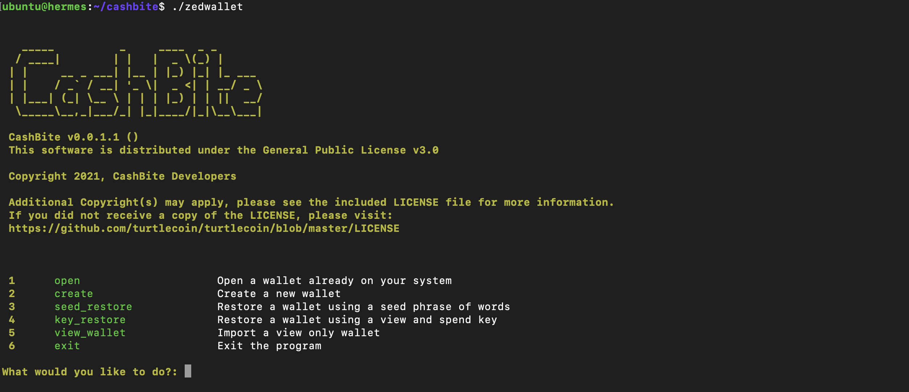
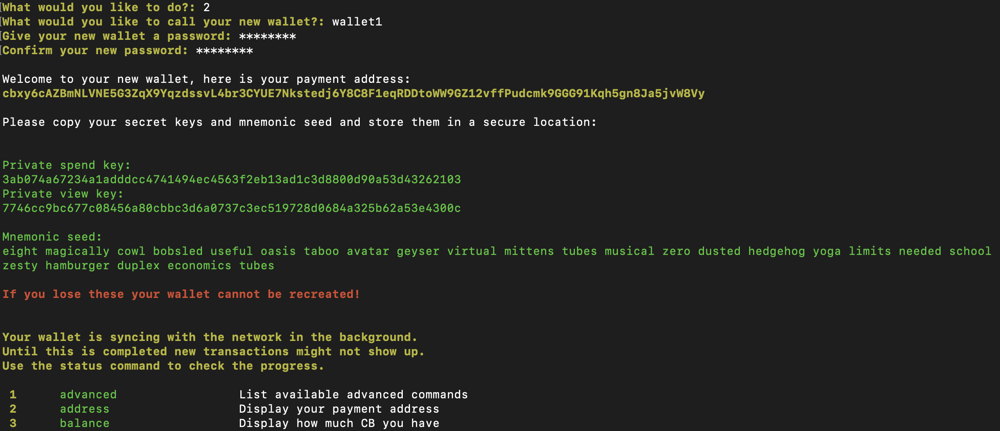
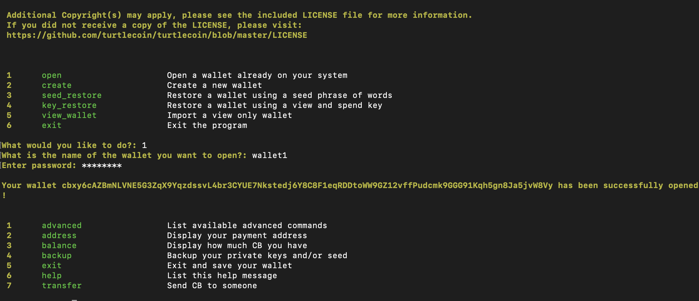
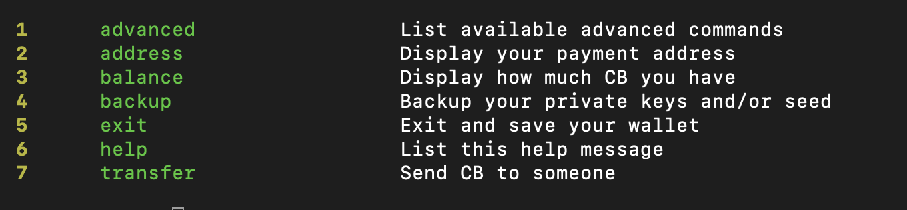

# Creating a Wallet

A wallet is like an account on the blockchain and allows you to send and receive cryptocurrency.

## Terminology

- A **seed phrase** is a representation of your wallet as words. These words can be used to derive the keys for your wallet, so it makes a great way to back up your wallet.

## Using zedwallet

Firstly, [install zedwallet](./install.md).

### Starting a Node

zedwallet requires a node to communicate with, so you will need to run one on your computer. To do this, simply open a terminal or command prompt and run CashBited (for example, on Windows use the command `./CashBited.exe` and on Linux use the command `./CashBited`).

When starting, your node will 'sync' with the network. This can take a while and you will get messages letting you know the progress. After the large text shows, the node is ready.

Leave the node running in the background while you continue. Once you are done, type `exit` into the window to safely stop the node.

### Running zedwallet

Now, open another terminal or command prompt and run zedwallet (for example, on Windows use the command `./zedwallet.exe` and on Linux `./zedwallet`).

You will get a menu like this:

#### Creating a Wallet

At the main menu, choose option 2 to create a new wallet.

The wallet name is the name of the file that contains your wallet's 'keys' is stored in (e.g. `wallet1`). The password is for the encryption of the file.

After typing those details, you will be given a payment address and some keys. **Make sure to write down the mnemonic seed** so that your wallet can be recovered if the file or password is lost.

#### Opening an Existing Wallet

At the main menu, choose option 1 to open your existing wallet.

Now, type the name of your wallet (e.g. `wallet1`) and it's password.

#### Using the Wallet

Once you have opened or created your wallet, you will see a menu like so:

- The **address** option can be used to see your wallet's public address which other people can send funds to.

- The **balance** options shows your current balance.

  _Available balance shows CB that you can spend now. Locked balance shows CB that you will get in the near future (it still needs to be confirmed by miners)._

- The **backup** option gives you the keys and seed phrase which you can write down as a backup.

- The **transfer** option allows you to send CB to another wallet.

  You will need to first type the address, of the recipient. For the payment ID, if you do not have one, you can leave it blank (this is mostly used if paying a service or website). Then you can type the amount of CB you would like to send (note: this must be less than your balance, as some is needed for a transaction fee).

#### Restoring a Wallet

On the main menu, choose option 3 to recover the wallet from a seed phrase. Then type the words that you noted down when you created your wallet. You will then be prompted to set a name and password for your wallet like before.

## Using the Paper Wallet Generator

Firstly, go to the [CashBite Paper Wallet Generator](https://cashbitecrypto.github.io/paper-wallet/).

### Creating a Wallet

Choose the 'Create a Wallet' button, and in the text box below, type in random characters. Then press the 'Generate' button. You will be given a public address, seed phrase, view key and spend key.

If you are not printing out this wallet, make sure to write down the **seed phrase** which will allow you to restore the wallet. **Only the public address should be shared with others!**

You can choose to print the page, in which case the paper can be folded along the lines to make something nice looking!

### Using a Wallet

To add funds to the wallet, simply use the public address.

To withdraw funds or for other actions, you will need to [restore in zedwallet](#restoring-a-wallet).
