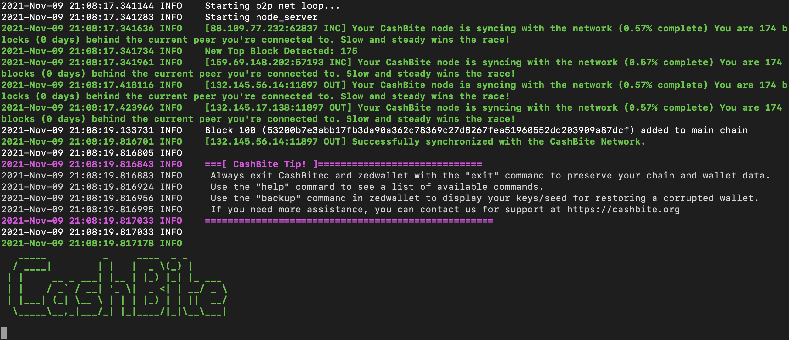

# Mining

Mining is a process of verifying transactions betweeen accounts. The process is very compute intensive, so miners are rewarded with some currency. Miners compete to verify blocks, the first to do this gets paid the reward.

## Simple Mining

To mine, you will need to have the `miner` program which you [installed](./install.md) earlier. You will also need to run a local node.

### Starting a Node

Mining requires a node to communicate with, so you will need to run one on your computer. To do this, simply open a terminal or command prompt and run CashBited (for example, on Windows use the command `./CashBited.exe` and on Linux use the command `./CashBited`).

When starting, your node will 'sync' with the network. This can take a while and you will get messages letting you know the progress. After the large text shows, the node is ready.



Leave the node running in the background while you continue. Once you are done, type `exit` into the window to safely stop the node.

### Starting the Miner

To run the miner, open a new terminal or command prompt. Then run one of the commands below. Make sure to add in your address to the command.

**Windows:**

```powershell
./miner.exe --address cbXXXXXXX... 
```

**Linux/macOS:**

```bash
./miner --address cbXXXXXXX... 
```

_Optionally, add `--threads 1` onto the command to use less CPU for mining._

## GPU & Pool Mining

_Coming Soon!_

## Miner Tips

- When using zedwallet, it will not show mining profits by default. Use `--wallet-file`, `--reset 0` (which will scan from the start of the blockchain) and `--scan-coinbase-transactions` to show mining profits. (e.g. `./zedwallet --wallet-file wallet1 --reset 0 --scan-coinbase-transactions`).
- With more miners, it will be more difficult to 'win' blocks. A more powerful computer can mine faster and give more chance against beating others.
- Mining in a pool lets you work with others to mine, which means you can get profits more regularly than if you were mining solo. Essentially the compute power of everyone in the pool is used to mine which makes mining fast.
